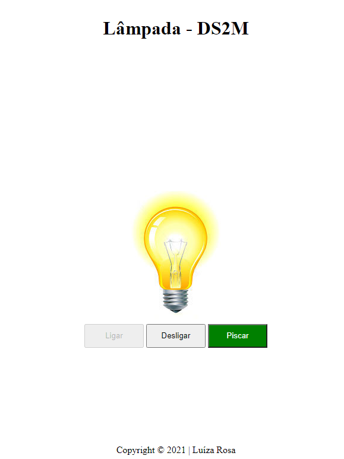

# Projeto - lâmpada

Projeto criado com objetivo didático para as aulas de PWFE do curso Desenvolvimento de Sistemas do [SENAI Jandira](https://jandira.sp.senai.br/), sob orientação do Prof.º Fernando Leonid.

O projeto consiste em criar uma lâmpada que tenha três ações: ligar, desligar e quebrar, utilizando vários eventos.

O código foi construído pensando em boas práticas, como responsabilidade única e funções puras.

